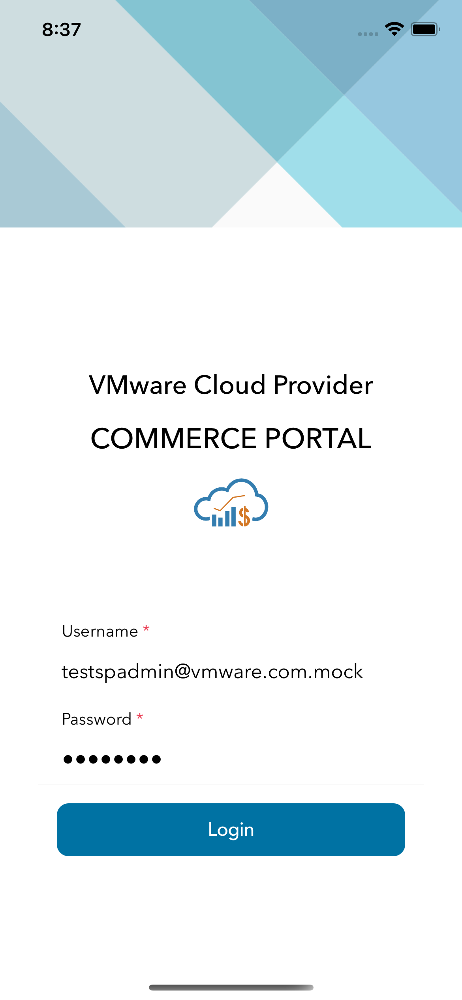
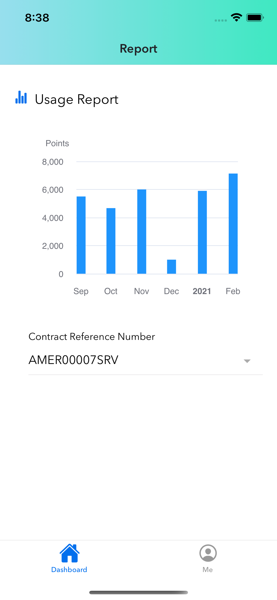
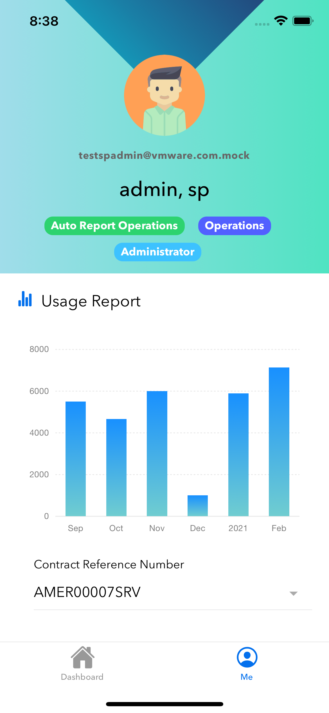

# VMware commerce portal mobile

## Get Started

Run `npm start` to view UI via browser.

## Capacitor Setup

### Build

```shell
npm run build # (ionic build) will generate www folder
```

### Create ios/android project

```shell
# run this command once
ionic cap add ios
ionic cap add android
```

Both android and ios folders at the root of the project are created. These are entirely standalone native projects that should be considered part of your Ionic app (i.e., check them into source control, edit them using their native tooling, etc.).

Every time you perform a build (e.g. ionic build) that updates your web directory (default: www), you'll need to copy those changes into your native projects:

```shell
ionic cap copy
```

Note: After making updates to the native portion of the code (such as adding a new plugin), use the sync command:

```shell
ionic cap sync
```

## iOS Deployment

```shell
ionic cap open ios # start without live reload

npm run start.ios # ionic cap run ios -l --external (live reload)
```

### Debugging iOS Apps

<https://ionicframework.com/docs/developing/ios#debugging-ios-apps>

## Android Deployment

```shell
ionic cap open android # start without live reload

npm run start.android # ionic cap run android -l --external (live reload)
```

### Debugging Android Apps

Run the app by AVD and paste this into Chrome: `chrome://inspect/#devices`

<https://ionicframework.com/docs/developing/android#debugging-android-apps>

## Contribute

**Run `npm run cz` to commit!**

## Screenshots







## Reference

- <https://ionicframework.com/docs/angular/your-first-app/6-deploying-mobile>
- <https://ionicframework.com/docs/angular/your-first-app/7-live-reload>
- <https://ionicframework.com/docs/developing/android>
- <https://ionicframework.com/docs/developing/ios>
